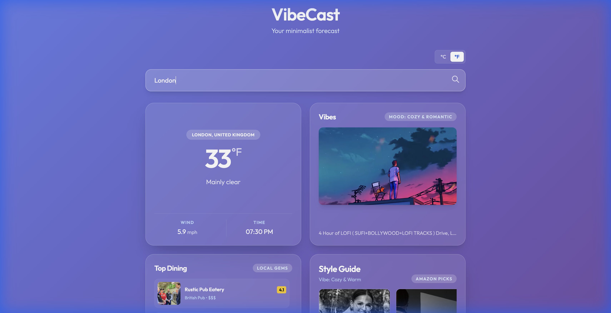

# VibeCast 🌤️🎧🛍️🍽️

**VibeCast** is a minimalist, lifestyle-oriented forecast application that curates your environment by recommending music, style, and dining options based on the real-time atmosphere of your location.



## ✨ Features

- **Unified Dashboard**: A responsive 2x2 grid layout that presents all key lifestyle metrics at a glance.
- **Minimalist Weather**: Glassmorphism-inspired UI showing real-time temperature, wind, and conditions.
- **Vibes (Music)**: Context-aware YouTube music recommendations (e.g., Lo-Fi for rain, Upbeat for sun).
- **Style Guide**: Amazon-linked apparel suggestions tailored to the current weather and time of day. Featuring a custom scrollable recommendation carousel.
- **Local Gems**: Top dining recommendations for the searched city, curated by cuisine and "vibe".

## 🏗️ Architecture

VibeCast is built with a modern, lightweight stack focusing on performance and aesthetics.

### Backend (`app/`)
- **Framework**: [FastAPI](https://fastapi.tiangolo.com/) (Python 3.12+)
- **Package Manager**: [uv](https://github.com/astral-sh/uv)
- **Services**:
    - `weather.py`: Integrates with [Open-Meteo](https://open-meteo.com/) for geocoding and weather data.
    - `music.py`: Logic for mapping weather codes to music moods and YouTube video IDs.
    - `shopping.py`: Logic for recommending clothing based on temperature thresholds.
    - `dining.py`: Mock service for generating culturally relevant restaurant data.

### Frontend (`app/static/`)
- **Technology**: Vanilla JavaScript (ES6+), HTML5.
- **Styling**: [Tailwind CSS](https://tailwindcss.com/) (via CDN) for rapid, responsive design.
- **Design System**: Glassmorphism with dynamic gradients, `Outfit` typography, and custom scrollbar styling.

## 🚀 Getting Started

### Prerequisites
- Python 3.12 or higher
- [uv](https://github.com/astral-sh/uv) (Recommended for fast package management)
    - *Alternatively, standard `pip` works too.*

### Installation

1.  **Clone the repository**:
    ```bash
    git clone https://github.com/vikbht/vibecast.git
    cd vibecast
    ```

2.  **Install dependencies**:
    ```bash
    uv sync
    # OR using pip
    pip install -r pyproject.toml
    ```

### Running the App

1.  **Start the development server**:
    ```bash
    uv run uvicorn app.main:app --reload
    ```

2.  **Open in Browser**:
    Navigate to [http://localhost:8000](http://localhost:8000)

## 🛠️ Configuration

The application uses `pydantic-settings`. You can create a `.env` file for API keys (optional for basic features):

```env
# Optional: For real Amazon Product Data
AMAZON_ACCESS_KEY=your_key
AMAZON_SECRET_KEY=your_secret
AMAZON_TAG=your_tag
```
